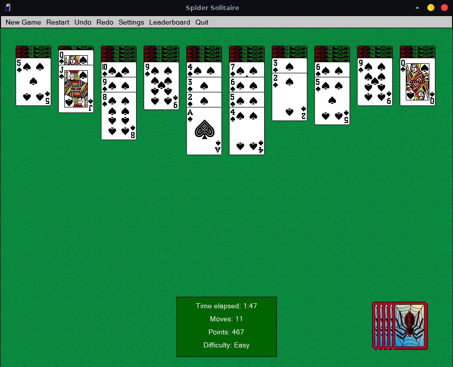
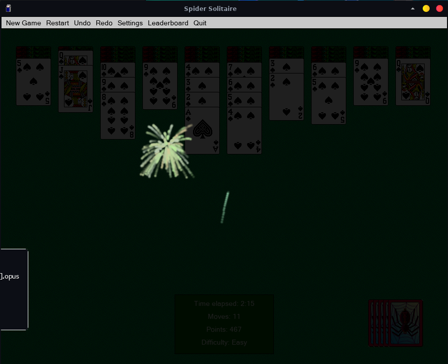

# spidersol

A teensy and messy Spider Solitaire implemented in C using SDL inspired by MS Solitaire and MS Spider Solitaire.

Supports some keybinds (u = undo, r = redo, tab = switch stack, enter = select stack, up/down = change the amount of cards drawn in the move, space = deal extra cards). Persists games and settings across runs, has three difficulty settings, multiple card backs to choose from. Has a classy victory animation. Doesn't implement too many animations or other eye candy. Doesn't implement hints.

Most of this game was written out of boredom during my bus ride.

